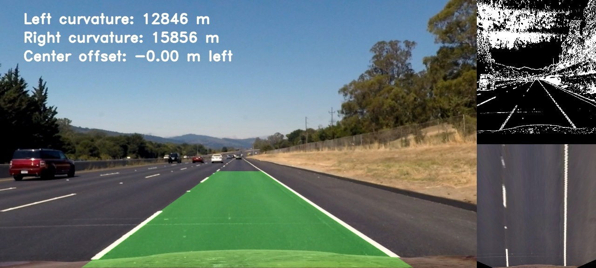

# Advanced Lane Finding
[](http://www.udacity.com/drive)


This project uses classical computer vision techniques to find the lane lines from video stream input.

## Overview

The objectives/steps of this project are as follows:

* Compute the camera calibration matrix and distortion coefficients given a set of chessboard images.
* Apply distortion correction to raw input images.
* Create thresholded binary image using color transforms, gradients, etc.
* Rectify binary images using perspective transfoem to achieve the birds-eye view. 
* Detect and fit lane pixels to find the lane lines.
* Determine the curvature of the lane the vehicle offset wrt the lane center.
* Warp back the detected lane lines onto the original image.
* Illustrate and output the lane curvature/radius and center offset on the original image highlighting lane lines.

In the following I will point out the [rubric points](https://review.udacity.com/#!/rubrics/571/view) item by item and explain how I addressed each item in my implementation.

### Camera Calibration
Firstly in the pipeline, the input images should be corrected for the distortion. Basically two types of distortions are considered in this work as follows:

|  Radial Distortion   |   Tangential Distortion  | 
|:-------------:|:-------------:| 
| This happens since real cameras use curved lenses to form an image, and light rays often bend a little too much or too little at the edges of these lenses.      | This occurs when a capture is not done prependicular to the image plane, so the camera's lens is not perfectly parallel to the imaging plane.        |
|  | |

To undistort an image, I needed to compute the intrinsic camera matrix and distortion coefficients. I used two helpful 'opencv' functions as follows:
* `cv2.calibrateCamera` to compute the intrinsic camera matrix and distortion coefficients
* `cv2.undistort` to undistort an image using the computed params

The code snippet to compute the intrinsic camera matrix and distortion cofficients is as follows:
```bash
# define number of internal chessboard corners in x and y direction
nx = 9
ny = 6
# prepare object points, like (0,0,0), (1,0,0), (2,0,0) ....,(6,5,0)
objp = np.zeros((nx*ny,3), np.float32)
objp[:,:2] = np.mgrid[0:nx,0:ny].T.reshape(-1,2)
# arrays to store object points and image points from all the images.
objpoints = [] # 3d points in real world space
imgpoints = [] # 2d points in image plane.
# make a list of calibration images
images = glob.glob('./camera_cal/calibration*.jpg')
show = True
# step through the list and search for chessboard corners
for image in images:
    img = cv2.imread(image)
    gray = cv2.cvtColor(img,cv2.COLOR_BGR2GRAY)
    # find the chessboard corners
    ret, corners = cv2.findChessboardCorners(gray, (nx,ny), None)
    # If found, add object points, image points
    if ret == True:
        objpoints.append(objp)
        imgpoints.append(corners)
        if show:
            # Draw and display the corners
            img = cv2.drawChessboardCorners(img, (nx,ny), corners, ret)
            cv2.imshow('img',img)
            cv2.waitKey(500)
    ret, mtx, dist, rvecs, tvecs = cv2.calibrateCamera(objpoints, imgpoints,
                                                      gray.shape[::-1], None, None)
cv2.destroyAllWindows()
```

As it can be noticed in the above snippet code, the chessboard images in `camera_cal` folder are used as inputs to the camera calibration function.

### Pipeline (test images)
I explain each step of the developed pipeline in details in this section.

#### Distortion Correction
Distortion correction is calculated via applying camera calibration to each image. The camera calibratin matrix `mtx`, and distortion coefficients`dist` are then for distortion correction of raw images. The `cv2.undistort` function of `opencv` library is used as follows:

```bash
undistorted_img = cv2.undistort(img, mtx, dist, None, mtx)
```
Applying the distortion correction function to a test image will output an undistorted image as shown below:


|  Raw input image   |   Undistorted image  | 
|:-------------:|:-------------:| 
| This happens since real cameras use curved lenses to form an image, and light rays often bend a little too much or too little at the edges of these lenses.      | This occurs when a capture is not done prependicular to the image plane, so the camera's lens is not perfectly parallel to the imaging plane.        |
|  | |

#### Color Transform & Thresholding
The second part of the pipeline is to transform the undistorted input image into different color models using thresholding for different color channels and feature extraction operation.
Combination of different color channels, gradients, filters with defferent threshold values outputs the thresholded binary image. My strategy in this pipeline is to have a couple of different color channels with strict thresholds and combine them using logical `OR` operation. The output binaty image is comprised of the following features:

* rgb combined for white color lane lines
* hsv combined for shadowed yellow lane lines
* threshold s channel with a mask to suppress shadow with high s value
* gradient on x-axis with sobel kernel size of 5
* gradient direction and magnitude with sobel kernel size of 5

The related code snippet for generating combined binary images of the above features is given as below.

```bash
def combined_sobel_grad_dir_thresh(img, ksize, show=False):
    # apply each of the thresholding functions
    Sx_binary = abs_sobel_threshold(img, orient='x', sobel_kernel=ksize, thresh=(20, 100)) 
    Sy_binary = abs_sobel_threshold(img, orient='y', sobel_kernel=ksize, thresh=(20, 100)) 
    mag_binary = mag_threshold(img, sobel_kernel=ksize, thresh=(20, 100)) 
    dir_binary = dir_threshold(img, sobel_kernel=ksize, thresh=(0.7, 25))    
    # combine all binary function outputs
    combined_binary = np.zeros_like(dir_binary)
#     combined_binary[((Sx_binary==1)&(Sy_binary==1)) | ((mag_binary==1)&(dir_binary==1))]=1
    combined_binary[(Sx_binary==1) | ((mag_binary==1)&(dir_binary==1))]=1
    
    # convert RGB to HSL
    hls = cv2.cvtColor(img, cv2.COLOR_RGB2HLS)
    s_channel = hls[:, :, 2]
    # thresholds for color channel
    s_thresh_min = 100 
    s_thresh_max = 255
    s_binary = np.zeros_like(s_channel)
    s_binary[(s_channel>=s_thresh_min) & (s_channel<s_thresh_max)] = 1
    # combine binary matrices for S channel and combined 
    combined_s_binary = np.zeros_like(combined_binary)
    combined_s_binary[(combined_binary==1) | (s_binary==1)] = 1
    
    if show:
        p, (ax1, ax2, ax3, ax4) = plt.subplots(1, 4, figsize=(20, 10))
        ax1.set_title('Original image')
        ax1.imshow(img)
        ax2.set_title('Combined x, y gradients, magnitude and direction')
        ax2.imshow(combined_binary, cmap='gray')
        ax3.set_title('Color thresholding - S channel')
        ax3.imshow(s_binary, cmap='gray')
        ax4.set_title('combined all binaries')
        ax4.imshow(combined_s_binary, cmap='gray')
    
    return combined_s_binary
```
Notice in the above code the threshold values for each specified operation. An example of combined binary is shown in the following image for a few test images.


#### Perspective Transform
Calculating the lane lines' curvature is being easier when the lane lines are parallel in the captured image. Since the images are captured through the camera's perspective, the lane lines are not parallel and intesect at a vansishing point. To have the principal property of lane lines, which makes them parallel, perspective transform is applied to output the bird-eye view which is desired for further calculation of finding lane curvature. `opencv` has useful functions for these operations as below:
* `cv2.getPerspectiveTransform` compute the convert matrix given source and destination points in the figure
* `cv2.warpPerspective` uses convert matrix to convert a perspective image to bird-eye view

As required for perspective transform function, the source and destination points are defined as in the related code snippet shown below.
```bash
img_size = (img.shape[1], img.shape[0])
# reference points for perspective transform
lu_point = [589, 460]
ru_point = [705, 460]
ll_point = [203, 720]
rl_point = [1127, 720]
# define source and destination 
src = np.float32([lu_point, ll_point, ru_point, rl_point])
dst = np.float32([[320, 0], [320, 720], [960, 0], [960, 720]])

def ROI(img):
    return cv2.polylines(img,np.int32(np.array([[ll_point,lu_point,ru_point,rl_point]])),True,(255,0,0),10)

def WarpPerspective(img):
    y=img.shape[0]
    x=img.shape[1]
    M = cv2.getPerspectiveTransform(src, dst)
    return cv2.warpPerspective(img, M, (x,y), flags=cv2.INTER_LINEAR)
```
The convert matrix and perspective warp are used in the `WarpPerspective` function shown above.

The region of interest of the input images is chosen based on the source and destination points, then this region is warped to output a bird-eye view of the input image. The warped output of a few test images is shown in figure below.


#### Fine Lane Line Pixels
The next step in the pipeline is to fine lane line pixels seperately for left and right lines and fir them with a 2nd order polynomial. Two methods are used in this pipeline; `sliding window` and `previous fit`. The `sliding window` is the basic operation which splits image into multiple layes and slide a window at the most intense area and mark the lane line points inside the window. On the other hand, `previous fit` searth within tighter range from previous found lane lines which make it faster and more robust. 

The respective code snippet for this step in the pipeline is as follows.
```bash
# locate lane lines and window fitting having histogram of line points
def locate_lines(warped_binary, nwindows=9, margin=140, minpix=50): # margin=100
    # take the histogram of candidate points for detecting lane line
    histogram = hist(warped_binary)
    # find the peak of the left and right lines on histogram
    midpoint = np.int(histogram.shape[0]//2)
    leftX_base = np.argmax(histogram[:midpoint])
    rightX_base = np.argmax(histogram[midpoint:]) + midpoint
    # set the height of the windows
    window_height = np.int(warped_binary.shape[0]//nwindows)
    # spot the x and y direction of all activated pixels in the image
    nonzero = warped_binary.nonzero()
    nonzeroX = np.array(nonzero[1])
    nonzeroY = np.array(nonzero[0])
    # Current positions to be updated later for each window in nwindows
    leftX_current = leftX_base
    rightX_current = rightX_base 
    # create a list to record left and right pixel indices
    left_lane_idx = []
    right_lane_idx = []
    # Create an image to draw on 
    output_img = np.dstack((warped_binary, warped_binary, warped_binary))*255    
    for window in range(nwindows):
        # identify window boundaries in x and y 
        winY_low = warped_binary.shape[0] - (window+1)*window_height
        winY_high = warped_binary.shape[0] - window*window_height
        winXleft_low = leftX_current - margin
        winXleft_high = leftX_current + margin
        winXright_low = rightX_current - margin
        winXright_high = rightX_current + margin
        # Draw the windows on the visualization image
        cv2.rectangle(output_img, (winXleft_low, winY_low), (winXleft_high, winY_high),
        (0,255,0), 2) 
        cv2.rectangle(output_img, (winXright_low, winY_low), (winXright_high, winY_high),
        (0,255,0), 2) 
        # Identify the nonzero pixels in x and y within the window
        good_left_inds = ((nonzeroY >= winY_low) & (nonzeroY < winY_high) & 
        (nonzeroX >= winXleft_low) &  (nonzeroX < winXleft_high)).nonzero()[0]
        good_right_inds = ((nonzeroY >= winY_low) & (nonzeroY < winY_high) & 
        (nonzeroX >= winXright_low) &  (nonzeroX < winXright_high)).nonzero()[0]
        # append these indices to the lists
        left_lane_idx.append(good_left_inds)
        right_lane_idx.append(good_right_inds)
        # if found > minpix pixels, recenter next window on their mean position
        if len(good_left_inds) > minpix:
            leftX_current = np.int(np.mean(nonzeroX[good_left_inds]))
        if len(good_right_inds) > minpix:        
            rightX_current = np.int(np.mean(nonzeroX[good_right_inds]))    
            
    # Concatenate the arrays of indices
    left_lane_idx = np.concatenate(left_lane_idx)
    right_lane_idx = np.concatenate(right_lane_idx)    
    # Extract left and right line pixel positions
    leftX = nonzeroX[left_lane_idx]
    leftY = nonzeroY[left_lane_idx] 
    rightX = nonzeroX[right_lane_idx]
    rightY = nonzeroY[right_lane_idx]     
    # Fit a second order polynomial to each
    if len(leftX) == 0:
        left_fit =[]
    else:
        left_fit = np.polyfit(leftY, leftX, 2)
    
    if len(rightX) == 0:
        right_fit =[]
    else:
        right_fit = np.polyfit(rightY, rightX, 2)
        
    return left_fit, right_fit, left_lane_idx, right_lane_idx, nonzeroX, nonzeroY   
    
def locate_line_further(left_fit, right_fit, binary_warped):    
    nonzero = binary_warped.nonzero()
    nonzeroy = np.array(nonzero[0])
    nonzerox = np.array(nonzero[1])
    margin = 100
    left_lane_inds = ((nonzerox > (left_fit[0]*(nonzeroy**2) + left_fit[1]*nonzeroy + left_fit[2] - margin)) 
                      & (nonzerox < (left_fit[0]*(nonzeroy**2) + left_fit[1]*nonzeroy + left_fit[2] + margin))) 
    right_lane_inds = ((nonzerox > (right_fit[0]*(nonzeroy**2) + right_fit[1]*nonzeroy + right_fit[2] - margin)) 
                       & (nonzerox < (right_fit[0]*(nonzeroy**2) + right_fit[1]*nonzeroy + right_fit[2] + margin)))  
    # Again, extract left and right line pixel positions
    leftx = nonzerox[left_lane_inds]
    lefty = nonzeroy[left_lane_inds] 
    rightx = nonzerox[right_lane_inds]
    righty = nonzeroy[right_lane_inds]
    
    # Fit a second order polynomial to each
    if len(leftx) == 0:
        left_fit_new =[]
    else:
        left_fit_new = np.polyfit(lefty, leftx, 2)
    
    if len(rightx) == 0:
        right_fit_new =[]
    else:
        right_fit_new = np.polyfit(righty, rightx, 2)
     
    return left_fit_new, right_fit_new
```

The output of a test image through this step in the pipeline is shown as below.


#### Compute the Lane Curvature and Position Offset
The curvature of the lane lines are defined to be fit to a 2nd oder polynomial. An illustration over the candidate lane line pixels is shown in figure below.


The lane curvature and the vehile's position offset with respect to the lane center is computed as shown in the code snippet below. They are then put on the pipeline's output illustration which is whon in following.
```bash
def radius_curvature(warped_binary, left_fit, right_fit):
    
    ploty = np.linspace(0, warped_binary.shape[0]-1, warped_binary.shape[0] )
    # conversion from pixel to meter
    ym_per_pix = 30/720 # meters per pixel in y-dimension
    xm_per_pix = 3.7/700 # meters per pixel in x-dimension
    y_eval = np.max(ploty)
    
    # fit new polynomials in world model
    left_curvature =  ((1 + (2*left_fit[0]*y_eval*ym_per_pix + left_fit[1])**2)**1.5) / np.absolute(2*left_fit[0])
    right_curvature = ((1 + (2*right_fit[0]*y_eval*ym_per_pix + right_fit[1])**2)**1.5) / np.absolute(2*right_fit[0])
       
    # calculate vehicle center
    center = (((left_fit[0]*720**2+left_fit[1]*720+left_fit[2]) 
               +(right_fit[0]*720**2+right_fit[1]*720+right_fit[2]) )
               /2 - 640)*xm_per_pix
    position = "left" if center < 0 else "right"
    center = "{:.2f} m {}".format(center, position)
    
    # Now our radius of curvature is in meters
    return left_curvature, right_curvature, center
```

#### Image Pipeline Output
In this part, last part of the pipeline, I put all the previous steps together; the fit from the rectified image is warped back onto the original image and plotted to identify the lane lines. The code snippet that bring all steps together is shown as below:
```bash
def pipeline(img):
    undistorted_image= undistort_image(img)
    warped_image, M= perspective_trnsform(undistorted_image, nx=9, ny=6)
    combined_image = combined_sobel_grad_dir_thresh(warped_image, ksize=3, show=False)
    combined_image_full = combined_sobel_grad_dir_thresh(undistorted_image, ksize=3, show=False)            
    left_fit, right_fit, left_lane_idx, right_lane_idx, nonzeroX, nonzeroY = locate_lines(combined_image, nwindows=9, margin=100, minpix=50)
        
    left_curvature, right_curvature, center = radius_curvature(combined_image, left_fit, right_fit)
    result=draw_on_image(undistorted_image, combined_image, left_fit, right_fit, M, left_curvature, right_curvature, center, show_values = True)
    
    #Composition of images to final display
    img_out=np.zeros((576,1280,3), dtype=np.uint8)

    img_out[0:576,0:1024,:] =cv2.resize(result,(1024,576))
    #b) Threshold
    img_out[0:288,1024:1280, 0] =cv2.resize(combined_image_full*255,(256,288))
    img_out[0:288,1024:1280, 1] =cv2.resize(combined_image_full*255,(256,288))
    img_out[0:288,1024:1280, 2] =cv2.resize(combined_image_full*255,(256,288))
    #c)Birds eye view
    img_out[310:576,1024:1280,:] =cv2.resize(warped_image,(256,266))
    
    #Write curvature and center in image
    TextL = "Left curvature: " + str(int(left_curvature)) + " m"
    TextR = "Right curvature: " + str(int(right_curvature))+ " m"
    TextC = "Center offset: " + str(center)
    fontScale=1
    thickness=2
    
    fontFace = cv2.cv2.FONT_HERSHEY_DUPLEX


    cv2.putText(img_out, TextL, (50, 50), fontFace, fontScale,(255,255,255), thickness,  lineType = cv2.LINE_AA)
    cv2.putText(img_out, TextR, (50,90), fontFace, fontScale,(255,255,255), thickness,  lineType = cv2.LINE_AA)
    cv2.putText(img_out, TextC, (50,130), fontFace, fontScale,(255,255,255), thickness,  lineType = cv2.LINE_AA)
    return img_out
```

The image output contains the lanes, curvature, and offset position of the vehicle plus the respective combined binary output and the bird-eye view.

|  Raw input image   |   Pipeline Output  | 
|:-------------:|:-------------:| 
|  | |

### Pipeline (video)
The video pipeline is based on the image pipeline with some differences pointed below:
* `previous fit` is used to make the lane line pixles finding smoother and faster. 
* `sanity check` is used to gurantee the robustness of transition between sliding window and previous fit.

The pipeline's output video of the project video can be found in the current directory named `project_video_output.mp4`. You can access the video by clicking on the a frame of video below.

[](project_video_output.mp4)

### Discussion
##### Hihlights/challenges
This project was trickier than what I was expecting. Getting the pipeline to be robust against shadows and being capable of detecting yellow and white colors with different shadow level is a great challenge. i tried to approach this issue to avoid having very low saturation by setting a minimal value for the saturation once paied with the x-fradient and the absolute gradient threshold. There is also a challengin problem when multiple lane lines are in the region of interest and my pipeline fails once couple of lines are seen as I tested my algorithm against a self-recorded video. The proposed pipeline required me to tune many hyper-parameters regarding the thresholding for different operations, reference points, permutation of different color models/channels, etc. This will make the solution huristic and limits its capability for general lane finding. As tested against challenge videos, changes in road conditions, illumunations, and colors affects most the pipeline's output.  

##### Further Study
As mentioned before, the proposed pipeline is bsed on heuristics and works fine on the models developed upon. To make this work more robust and increase its performance, the following techniques can be used:
* use convolutional neural networks to learn which parts of the road are important and detect the lane lines in those parts
* dynamic and adaptive thresholding 
* broader range of color spaces such as LUV and LAB

 
 
